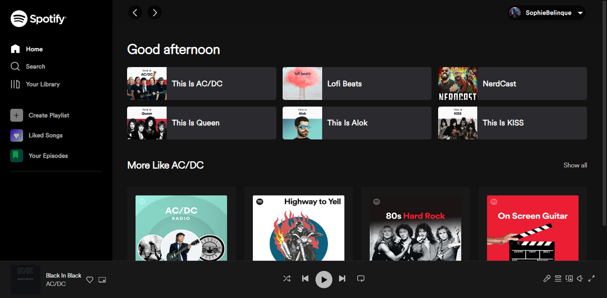

<h1 align="center"> Spotify Clone </h1>

Um clone da interface inicial do Spotify em HTML, SCSS e JavaScript.

  <a href="#-tecnologias">Tecnologias</a>&nbsp;&nbsp;&nbsp;|&nbsp;&nbsp;&nbsp;
  <a href="#-projeto">Projeto</a>&nbsp;&nbsp;&nbsp;|&nbsp;&nbsp;&nbsp;
  <a href="#-contato">Contato</a>

  

 

  

## 🚀 Tecnologias

Esse projeto foi desenvolvido com as seguintes tecnologias:

- HTML
- SASS
- JavaScript

## 💻 Projeto

O objetivo deste projeto foi recriar a interface de usuário inicial do Spotify, proporcionando uma experiência visual e interativa semelhante ao original. Com o uso de SCSS, conseguimos criar um design moderno do site, enquanto o JavaScript foi utilizado para implementar funcionalidades interativas, como a adição das músicas em cards e informar Bom dia, tarde e noite.

Dê uma olhada no projeto clicando nesse [link](https://matheusfdosan.github.io/spotify-clone/).

## Licença

Este projeto está sob a licença MIT. Sinta-se à vontade para contribuir, fazer fork e usar este projeto como base para seus próprios projetos!

## Contato

- Acesse também meus outros repositórios no [Github](https://github.com/matheusfdosan?tab=repositories).

- Também me siga no [Instagram](https://instagram.com/matheusfdosan).
